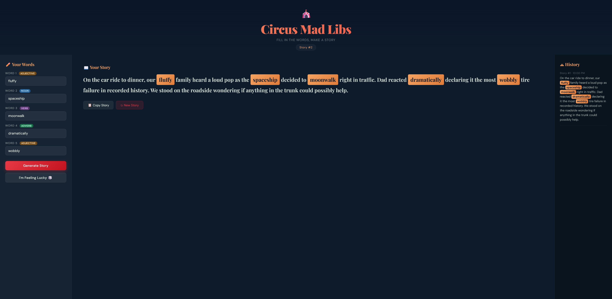

# Circus MadLibs Generator 🎪

An interactive web-based MadLibs game built using Vibe=-Coded HTML, CSS, and JavaScript.

## Features
- User-input word fields
- Dynamic story generation
- Animated word pop-ins
- Story history panel
- Multiple themed storylines

## Purpose
Built to experiment with:
- DOM manipulation
- Interactive UI design
- Client-side JavaScript logic
- Creative storytelling mechanics

## Screenshot

## Live Demo

Play it here:
https://badenaaron-oss.github.io/Circus-Mad-Libs/

## Future Improvements
- Sound effects
- Mobile layout optimization
- More dynamic story templates
